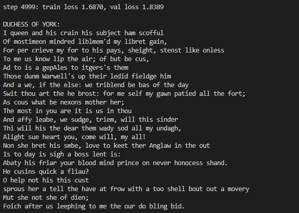

# nanoGPT from scratch

A small character-level GPT (decoder-only Transformer) trained on Shakespeare, written in PyTorch.

I built this by following Andrej Karpathy's lecture [*Let's build GPT: from scratch, in code, spelled out*](https://www.youtube.com/watch?v=kCc8FmEb1nY). The goal was to understand the Transformer from the paper *Attention Is All You Need* by writing each part myself instead of calling a library.

## What's inside

| Part | What it does |
|---|---|
| `Head` | One self-attention head: query, key, value, scaled dot-product, causal mask so a token can't see the future |
| `MultiheadAttention` | 4 heads run in parallel, outputs concatenated and projected back |
| `FeedForward` | Per-token MLP (expand ×4, ReLU, project back) |
| `Block` | Pre-LayerNorm + residual connections around attention and the MLP |
| Model | Token + position embeddings → 4 blocks → LayerNorm → linear layer to the vocabulary |

**Data:** `input.txt` is the Tiny Shakespeare dataset (~1.1M characters). Each unique character is one token, and the split is 90% train / 10% validation.

**Config:** 4 layers, 4 heads, 64-dim embeddings, context of 32 characters, batch 16, AdamW at lr 1e-3, 5,000 steps.

## Run it

```bash
pip install torch
python main.py
```

It prints train/val loss every 100 steps, then generates 2,000 characters of Shakespeare-style text.

## Results



Final loss after 5,000 steps:  train loss **1.6870**, val loss **1.8389**
The output is not readable yet, but it has learned the structure of the text: speaker names, line breaks, and word-like spelling. This is expected for a model this small 


## What I learned

- **Core Concept of *Attention Is All You Need!*** which include Multi-Head Attention, Add & Norm and FeedForward
- **tokenizing** the model make the Character encode with index for fit the char in matrix then decode when we gonna use it   
- **MASK is needed** the model need mask for prevent model looking at the next word
- **Reason why attention is divided by √head_size** the model divides the vectors by `√head_size` to normalize the numbers, since after the dot product the numbers grow very large and one position gets ~100% of the weight while the rest get ~0. So we divide by `√head_size`, which is the size of each head's vectors.

